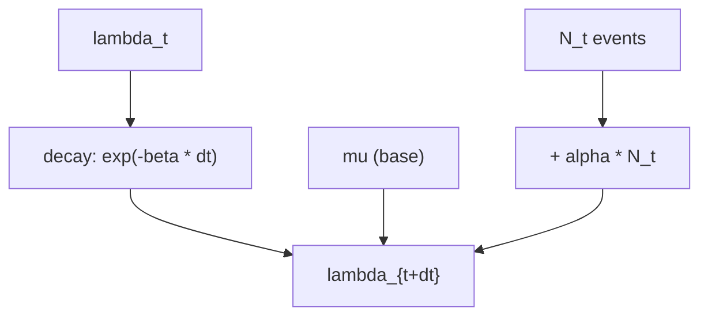

# lob_simulator_core

Simulateur d’order book **HFT-ready** (L1–L10), avec flux d’ordres Poisson/Hawkes, exécutions, annulations et visualisation (CSV & Live). Pensé comme base pour un environnement **Deep RL** avec contraintes de **latence** et microstructure.

## Features
- Carnet agrégé **price-level** (BID/ASK), profondeur configurable (L1–L10+)
- Ordres: **limit**, **market**, **cancel**
- Modèles d’arrivée: **Poisson** (constantes), **Hawkes** (auto-excitation)
- **Logger** d’état par pas (CSV): L1–L10 prix/vol, best bid/ask, spread, mid, imbalance
- **Visualisation**
  - `animate_trace.py` (depuis CSV): L10 animé + courbes **mid**, **spread**, **imbalance**
  - `animate_live.py` (live): animation branchée sur la **boucle de simulation**
- Code **PEP 604** (`float | None`) et API propre, prête pour Gym/pybind11 plus tard

## Installation

```bash
python -m venv .venv
# Windows
.venv\Scripts\activate
# macOS/Linux
source .venv/bin/activate

pip install -r requirements.txt
```

**requirements.txt**
```
numpy
pandas
matplotlib
pillow    # pour exporter en GIF
```

> Pour exporter en **MP4**, il faut `ffmpeg` (ex. `conda install -c conda-forge ffmpeg`).

## Quick Start

### 1. Simulation + trace CSV
Génère un CSV avec L1–L10, mid, spread, etc.
```bash
python run_simulation.py --model poisson --seconds 5 --dt_ms 1 --out lob_trace.csv
python run_simulation.py --model hawkes  --seconds 5 --dt_ms 1 --out lob_trace_hawkes.csv
```

### 2. Animation enrichie (depuis CSV)
Affiche l’animation et/ou enregistre un GIF.
```bash
# Afficher
python animate_trace.py --csv lob_trace.csv --depth 10 --interval_ms 30

# Sauver en GIF (nécessite pillow)
python animate_trace.py --csv lob_trace.csv --depth 10 --save lob_anim.gif
```

### 3. Animation **live**
Anime directement la boucle de simulation (Poisson + Market + Cancel).
```bash
python animate_live.py --model poisson --seconds 8 --dt_ms 1 --depth 10
python animate_live.py --model hawkes  --seconds 8 --dt_ms 1 --depth 10
```

## Demo

> Exemple de rendu (généré avec `animate_trace.py`) :


## Paramètres utiles
- `--limit_*`, `--market_*`, `--cancel_*` : intensités (événements/seconde) par côté
- `--tick` : taille de tick (ex: 0.01)
- `--dt_ms` : pas de temps (ms)
- `--depth` : profondeur du carnet affichée (Lk)

## Sanity Checks
Pour vérifier rapidement la trace CSV :
```python
import pandas as pd
df = pd.read_csv("lob_trace.csv")
assert (df["spread"] >= -1e-9).all()
assert (df["best_bid"] <= df["best_ask"]).all()
assert (abs(df["mid"] - (df["best_bid"] + df["best_ask"]) / 2) < 1e-9).all()
print("OK — invariants de base vérifiés")
```

---

## Microstructure 101 (schémas) & paramètres

### Schéma de flux (du modèle au carnet)


### Intuition Hawkes (mise à jour d'intensité)


### Échelle du carnet (exemple)
```
ASK_VOL     PRICE     BID_VOL
  320      100.04        180
  450      100.03        240
  600      100.02   ←  best ask
----------------  SPREAD  ----------------
  290      100.01   →  best bid
  520      100.00        410
```

### Paramètres & effets

**Généraux**
- `tick_size` : taille de pas de prix (ex: 0.01). Plus petit ⇒ carnet plus fin.
- `depth_levels` : profondeur agrégée (L1–Lk) retournée par `snapshot`.

**Poisson (constantes)**
- `limit_*_lambda` : arrivées de limites (év/s). ↑ ⇒ carnet s'épaissit, spread se resserre.
- `market_*_lambda` : arrivées au marché. ↑ ⇒ top-of-book se vide, spread respire/monte.
- `cancel_*_lambda` : annulations. ↑ ⇒ carnet plus “nerveux”, moins de profondeur.

**Hawkes (auto-excitation)**
- `mu[key]` : intensité de base (év/s) pour `key ∈ {limit_bid, ..., cancel_ask}`.
- `alpha[key]` : saut d’intensité par événement (contagion). ↑ ⇒ rafales.
- `beta[key]` : vitesse de décroissance (1/s). ↑ ⇒ mémoire plus courte.

> Rappel discret : `λ_{t+dt} = μ + (λ_t - μ)·exp(-β·dt) + α·N_t` avec `N_t ~ Poisson(λ_t·dt)`.

## Roadmap (extrait)
- Environnement Gym: **latency-aware** (file d’attente ordres, slippage dynamique)
- Agents RL: DQN → PPO/SAC (Optuna)
- Microstructure features (imbalance, queue position, short-term vol)
- Accélération **C++/pybind11** (Phase 7)
- Dashboard Streamlit (Projet 9)

## Licence
MIT